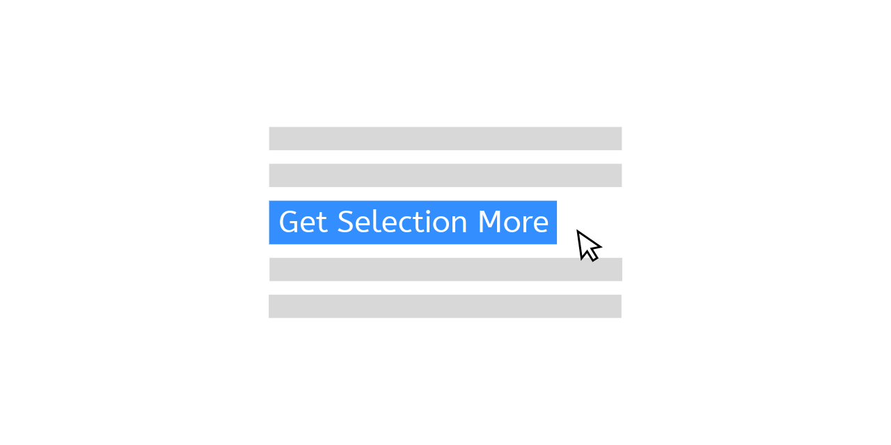

# Get Selection More [](https://www.npmjs.com/package/get-selection-more) [](https://travis-ci.com/crimx/get-selection-more) [](https://coveralls.io/github/crimx/get-selection-more?branch=master)



## APIs

```typescript
/**
 * Returns the selected text
 */
function getText(win?: Window): string
function getTextFromSelection(selection: Selection | null, win?: Window): string
/**
 * Returns the paragraph containing the selection text.
 */
function getParagraph(win?: Window): string
function getParagraphFromSelection(selection: Selection | null): string
/**
 * Returns the sentence containing the selection text.
 */
function getSentence(win?: Window): string
function getSentenceFromSelection(selection: Selection | null): string
```

Optionally pass `window` of other frame to get selection within that frame.

## Usage

```javascript
import { getText, getParagraph, getSentence } from 'get-selection-more'

document.addEventListener('selectionchange', () => {
  console.log(getText(), getParagraph(), getSentence())
})
```

Or load the UMD module directly which exposes `getSelectionMore` global.
